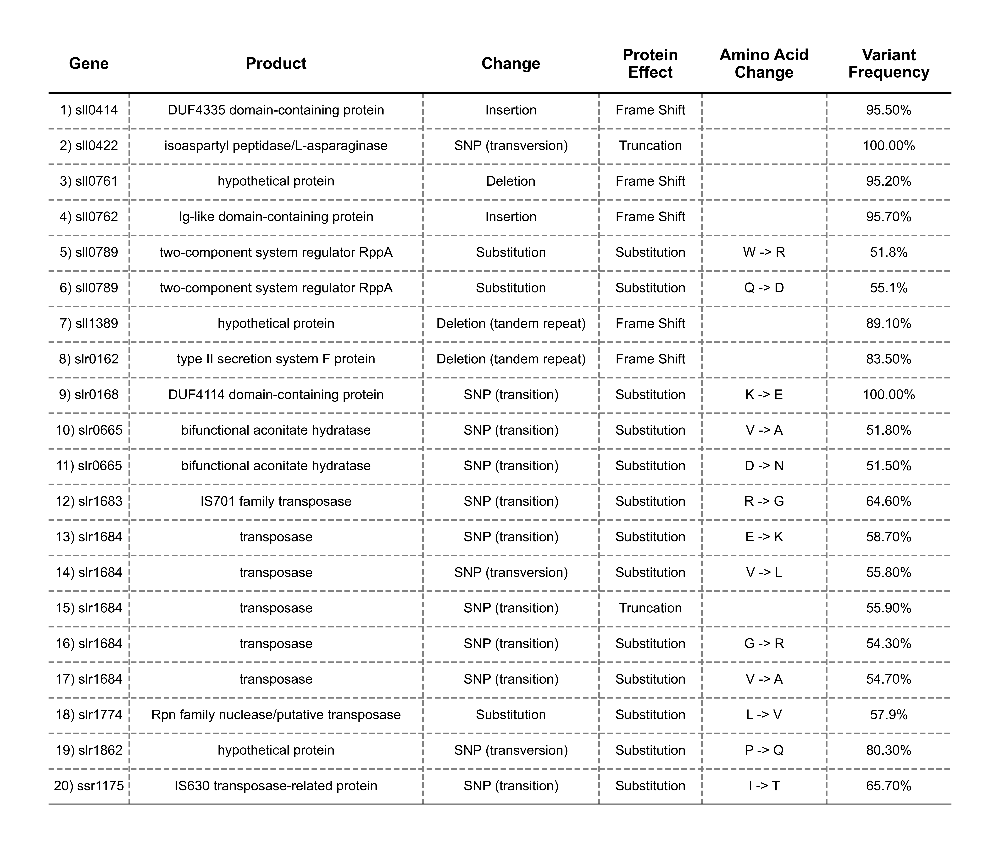

# MV Resistance Project 

*Table of contents*   
1. [WGS Circos Plotter - Python](#plot-WGS-circos-diagrams)
	1. [Read mapping against a reference genome](#plot-wgs-results-against-a-reference-genome)
	2. [Compare and visualise variants across multiple genomes](#filter-mutations-in-mutants-compared-to-respective-backgrounds)
	3. Plot global allelic distributions across genomes
2. [Experimental data analysis - Matlab](#experimental-data-analysis)
	1. Oxygen electrode data plotter
	2. Chronoamperometry plotter
	3. Square wave voltammetry plotter
	4. Growth curve plotter

#  Plot WGS Circos Diagrams 
Whole genome sequencing data were analysed using Geneious and custom python scripts. 

## Installation
 The scripts are based on python and can be executed via the terminal after having cloned the repository.
 Many of the circular plot diagrams are made using the package pyCirclize.

### Prerequisites
Before you run this script, you need to have the following Python packages installed:
- pycirclize
- pandas
- numpy
- matplotlib
- argparse

You can install these using pip:

```shell
pip install pycirclize pandas numpy matplotlib argparse
```

##  [Plot WGS results against a reference genome](GenSeqRefViewer.py)
[This script](GenSeqRefViewer.py) allows to generate a circular plot of a genomic structure. It draws a diagram of a genome along with various genomic annotations like Forward CDS, Reverse CDS, rRNA, tRNA, and also includes mutation and coverage data for a particular DNA sequencing strain.

### Data Requirements

Your data files should be located in the following paths:

- Coverage data and Identity data: `"Data/reads_alignments/{Strain}_{Reference}.csv"`
- Mutation data: `"Data/variant_analysis/{Reference}_allmutations.csv"`
- Genbank file for genome annotations: `"Data/genome_annotations/{Reference}.gff"`

Where:

- `{Strain}` is the strain from which the DNA sequencing reads are obtained.
- `{Reference}` is the accession number of the reference genome sequencing the reads have been aligned to.

The generated figure will be saved to `"Figures/WGS/{Strain}_vs_{Reference}_mutations.png"`.

#### Execution

You can run the script using Python3. From the terminal, navigate to the directory containing the script, and run the following command:

```shell
python3 GenSeqRefViewer.py -strain= "wt_Nixon" -ref= "NC000911"
```

Replace `<strain_name>` with the strain name (as labelled in the csv files) and `<reference_name>` with the reference genome NCBI accession number (e.g., 'NC000911').

### Outputs
The script generates a circular diagram of a genome with the given strain and reference genome, highlighting areas of low coverage and unconserved genomic regions. The final diagram is saved as a PNG image with a high resolution (DPI=900). The filename will be of the form `"{Strain}_vs_{Reference}_mutations.png"` and it will be saved in the `"Figures/WGS/"` directory.


In addition, a simple pyPlot table with the information regarding the mutations is also produced:




## [Filter Mutations in Mutants compared to Respective Backgrounds](filter_mutations.py)
[This script](filter_mutations.py) compare the mutations found in the mutant (e.g. mvR_1,2 etc...) with those in the respective background wild-type strains (e.g. wt_Nixon) when both compared against a reference genome (e.g. NC000911). The script returns a csv list of mutations (name ending with _filtered_mutations) containing resistant-specific mutations that are not present in the respective wild-type background. Mutations are considered the same when they occur in the same location and result in the same genetic change. In order for the script to work the Strain labels need to contain the background identified following an underscore (e.g. wt_Howe, mvR10_Howe). Only _Howe strains will be compared with each other. 

#### Execution
```shell
python3 filter_mutations.py -strains wt_Nixon mvR1_Nixon mvR2_Nixon mvR3_Nixon mvR6_Nixon -ref NC000911
```
## [Visualise Mutational Landscape Across Circular Genomes](plot_mutational_landscape.py)
This script plots the results obtained from the script above (filter_mutations.py) using circular genome diagrams indicating where each mutation occured in each strain genome. White ticks represent all mutations non present in wild-types (but also synonymous). In black, alongside the respective bold labels, are shown non-synonimous mutations.


#### Execution
```shell
python3 plot_mutational_landscape.py -ref NC000911
```
# Experimental data analysis
Experimental data such as electrochemical traces and results from spectroscopy were analysed and visualised with matlab. 

## Oxygen electrode data analysis

## Chronoamperometry data analysis

## Square wave voltammetry data analysis
This matlab script ([SWVplotter.m](Scripts/SWVplotter.m)) was used to analyse and plot data from square wave voltammetries (SWV). 

## Growth curve plotter
